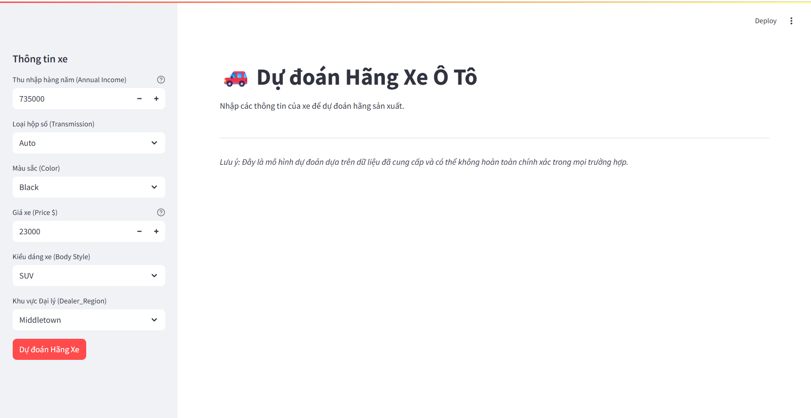
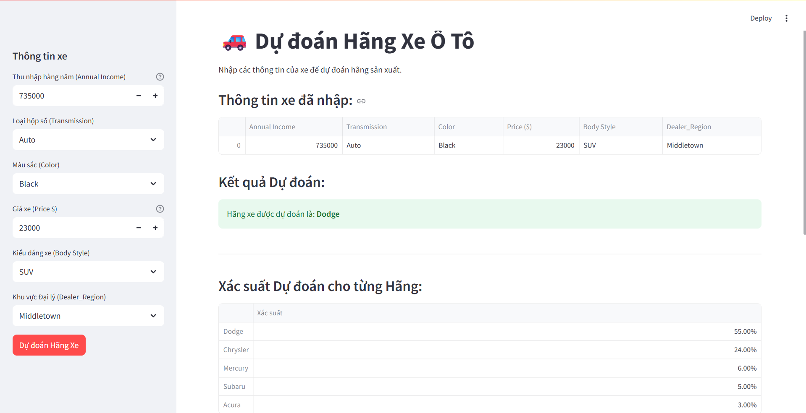
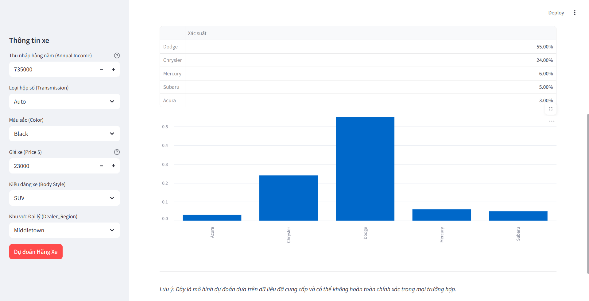

# CAR BRAND PREDICTION 

---
## Introduction

This project utilizes machine learning techniques to build a classification model capable of predicting a car's brand (Company) based on sales transaction data and customer characteristics.

---
## Project Goal
The primary objective is to develop a highly accurate model that can automatically determine the car company a customer is most likely to purchase from, based on attributes such as annual income, gender, vehicle type, color, and price.

---
## Business Impact & Real-World Applications
This model offers significant practical value for the automotive industry by providing data-driven insights to enhance business strategies:

* **Customer Segmentaion:** Helps dealerships and manufacturers better understand the target audience for each car brand. For example, which brands attract high-income customers or are more popular with a specific gender.
* **Marketing and Sales Support:** Enables more effective, targeted advertising campaigns. Sales teams can leverage customer data to recommend the most suitable car brands, improving conversion rates.
* **Market Analysis:** Provides deep insights into the relationship between customer demographics and brand preferences, helping to identify emerging market trends.

---
## Project Workflow

The project followed a structured machine learning pipeline:
#### 1. Data Preprocessing:
* **Data Cleaning:** Handled missing values and removed duplicate records.
* **Feature Engineering & Selection:** Dropped unnecessary or data-leaking features (Car_id, Phone, Model, etc.).
* **Outlier Handling:** Addressed outliers in numerical columns using the Interquartile Range (IQR) method.
* **Data Transformation:** Encoded categorical features and scaled numerical features to prepare the data for modeling.

#### 2. Exploratory Data Analysis (EDA):
* Visualized the distribution of key variables like car price and customer income.
* Analyzed relationships between features and the target variable (Company).

#### 3. Model Building and Evaluation:
* Addressed the class imbalance problem using the Random Oversampling technique.
* Built and compared the performance of several classification models:
  * Logistic Regression (as a baseline)
  * Decision Tree
  * K-Nearest Neighbors (KNN)
  * Random Forest
  * XGBoost
  * **LightGBM (Best Performing Model)**
  * CatBoost
  * Support Vector Machine (SVM)
* Conducted hyperparameter tuning for the top-performing models to optimize their accuracy.

#### 4. Model Performance

After training and evaluating multiple models, **LightGBM** delivered the best performance on the unseen test set.

| Model                    | Accuracy on Test Set |
| ------------------------ | -------------------- |
| Logistic Regression      | 7.80%                |
| Decision Tree            | 58.10%               |
| K-Nearest Neighbors      | 30.08%               |
| Random Forest            | 49.15%               |
| XGBoost                  | 60.61%               |
| **LightGBM (Tuned)**     | **61.39%**           |
| CatBoost                 | 56.33%               |
| SVM                      | 25.29%               |

#### Detailed Classification Report for Tuned LightGBM

Click to expand

           precision    recall  f1-score   support
    Acura      0.70      0.89      0.79       138
    Audi       0.59      0.76      0.66        94
     BMW       0.45      0.49      0.47       158
    Buick      0.68      0.72      0.70        88
    Cadillac   0.72      0.72      0.72       130
    Chevrolet  0.65      0.48      0.55       364
    Chrysler   0.56      0.59      0.57       224
    Dodge      0.68      0.58      0.63       334
    Ford       0.68      0.54      0.60       323
    Honda      0.62      0.61      0.61       142
    Hyundai    0.44      0.62      0.52       53
    Infiniti   0.51      0.62      0.56       39
    Jaguar     0.50      0.67      0.57       36
    Jeep       0.57      0.59      0.58       73
    Lexus      0.65      0.68      0.67       160
    Lincoln    0.57      0.73      0.64       98
    Mercedes-B 0.56      0.57      0.57       257 
    Mercury    0.65      0.68      0.66       175
    Mitsubishi 0.66      0.60      0.62       255
    Nissan     0.55      0.55      0.55       177
    Oldsmobile 0.63      0.58      0.60       222
    Plymouth   0.56      0.65      0.60       123
    Pontiac    0.61      0.69      0.64       159
    Porsche    0.40      0.47      0.43       72
    Saab       0.56      0.67      0.61       42
    Saturn     0.69      0.78      0.73       117
    Subaru     0.70      0.84      0.76       81
    Toyota     0.66      0.64      0.65       222
    Volkswagen 0.60      0.55      0.58       267
    Volvo      0.61      0.61      0.61       158
    accuracy                       0.61       4781
    macro avg 0.60       0.64      0.62       4781
    weighted avg 0.62    0.61      0.61       4781

--- 
## Demo

---

## Discussion on Model Performance
While an accuracy of **~61.4%** may seem moderate, it represents a strong result when considering the problem's inherent complexity. Here's why:

-   **High Multi-Class Complexity:** This is a 30-class classification task. A random guess would only be ~3.3% accurate. Our model's performance is over **18 times better than random chance**, indicating it has learned significant patterns.

-   **Inherent Data Challenges:** The dataset reflects real-world sales, where many brands have overlapping customer profiles (e.g., Ford vs. Chevrolet) and some are significantly less common (e.g., Jaguar), making perfect separation difficult.

-   **Proactive Data Leakage Handling:** The highly predictive `Model` feature was intentionally removed to prevent data leakage. While this decision ensures the model is robust and generalizable, it naturally constrains the maximum achievable accuracy on this specific dataset.

---
## Instructions
1. Clone this repository:
    `git clone https://github.com/your-username/your-repository-name.git
`

2. Navigate to the project directory:
  `cd your-repository-name`

3. Launch the Jupyter Notebook:
    `jupyter lab Classification.ipynb`

---

## Future Work
* Collect additional data or explore advanced data augmentation techniques to improve performance on minority classes.
* Experiment with Deep Neural Network architectures for this multi-class classification task.
* Deploy the best-performing model as a web application or API for easy integration into business workflows.

---
## Requirements:
pandas
numpy
scikit-learn
imbalanced-learn
matplotlib
seaborn
xgboost
lightgbm
catboost

